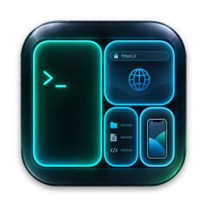

<p align="center">
  
</p>

<h1 align="center">Hyprmux</h1>

A Hyprland-style tiling environment for macOS, inside one window. Tiles hold
terminals ([libghostty](https://github.com/ghostty-org/ghostty)), web pages
(WebKit or Chromium), and apps: live iOS Simulator and Android Emulator screens,
VS Code, Cursor, and Zed. You drive them with Hyprland's keybinds, dispatchers,
workspaces, groups, and bezier animations, configured in `hyprland.conf` syntax
that reloads when you save it.

https://github.com/user-attachments/assets/e8d17d9a-0c64-484d-a049-5247830f8e8d

<sub>No video player? Here's [a GIF](docs/media/demo.gif). Recorded by
[`scripts/demo/record.sh`](scripts/demo/record.sh).</sub>

## Install

Download `Hyprmux-VERSION-arm64.dmg` from the
[latest release](https://github.com/gavrix/hyprmux/releases/latest), open it,
and drag Hyprmux to Applications. The app is signed with a Developer ID and
notarized by Apple. It needs macOS 14 or later, on Apple silicon.

To build it yourself, see [Build from source](#build-from-source).

## What goes in a tile

- **Terminals:** a full Ghostty terminal, with your Ghostty config, IME, mouse,
  clipboard, and shell integration.
- **Web pages:** back, forward, and reload buttons, and an address bar that
  takes URLs, hosts, or search terms. Popups open as new tiles. ⌘-click a link
  on a page or in a terminal to open it in a tile.
  - **WebKit engine:** light, but no passkeys.
  - **Chromium engine (CEF):** passkeys from your phone or a USB security key,
    enough for Okta and GitHub sign-in.
- **Devices and apps:** iOS Simulators, Android Emulators, VS Code, Cursor,
  and Zed. See [Bonus](#bonus-devices-and-apps).

## Features

- **Tiling:** the dwindle layout, with directional focus, move and swap,
  keyboard and mouse resizing, floating windows, and fullscreen or maximize.
- **Workspaces:** numbered workspaces that slide like Hyprland's, with optional
  names, plus a scratchpad.
- **Groups:** several windows as tabs in one tile.
- **Looks:** gradient borders, shadows, rounded or squircle corners, inactive
  opacity and blur, and a see-through background.
- **Session restore:** relaunching brings back workspaces, layouts, terminal
  directories, programs like nvim, agent sessions (pi, Codex), web pages, and
  app tiles.
- **Layouts:** save a workspace as a template (⇧⌘U) and summon it later (⌘U).
- **Pickers:** fzf-style lists for workspaces, apps, and an app's windows. ⌘/
  opens a menu of all of them.
- **Passwords:** the `fillcredential` dispatcher fills web fields and terminal
  password prompts from 1Password. See [Credentials](docs/CREDENTIALS.md).
- **Notifications:** config errors and terminal notifications (OSC 9 and
  OSC 777), styled like your terminal.
- **Keycast:** `hud:keycast` shows each shortcut as you press it, for
  recordings and screen sharing.
- **Scripting:** `hyprmuxctl`, a `hyprctl`-like CLI, plus event hooks. See
  [Scripting and agents](#scripting-and-agents).

## Quick start

Run `hyprmux-tour` in any Hyprmux terminal to take the tour again; see
[the tour](docs/TOUR.md). `SUPER` is ⌘. Keys are physical positions, so they
work with any keyboard layout.

These are the default binds. Change any of them in your config; see
[Configuration](#configuration).

| Keys                          | Action                                                       |
| ----------------------------- | ------------------------------------------------------------ |
| ⌘/                            | the menu: every picker and common actions, each with its key |
| ⌘↩                           | new terminal                                                 |
| ⌘B                            | new web tile (⌘O focuses the address bar)                    |
| ⌘I                            | show a booted iOS Simulator or running Android AVD (Mobile)  |
| ⌘D                            | open an app in a tile                                        |
| ⌘W                            | close                                                        |
| ⌘H/J/K/L, ⌘ arrows            | move focus                                                   |
| ⇧⌘H/J/K/L                     | move the window                                              |
| ⌃⌘H/J/K/L, or ⌘R then H/J/K/L | resize                                                       |
| ⌘1…9 / ⇧⌘1…9                  | switch workspace / move the window there                     |
| ⌘P / ⇧⌘P                      | pick a workspace to go to / to move the window to            |
| ⌘N                            | name the current workspace                                   |
| ⌘U / ⇧⌘U                      | summon a layout / save this workspace as one                 |
| ⌘S                            | scratchpad                                                   |
| ⇧⌘Space                       | float / re-tile                                              |
| ⌘F / ⇧⌘F                      | maximize / fullscreen the window                             |
| ⌃⌘F                           | full-screen Hyprmux itself                                   |
| ⌘G, ⌃Tab                      | make a group, switch tabs                                    |
| ⌘ + drag / ⌘ + right-drag     | move / resize with the mouse                                 |
| ⇧⌘R                           | reload config                                                |

The full default set is in [`config/hyprmux.conf`](config/hyprmux.conf). Keys
no bind claims go to the focused tile, so ⌘C and ⌘V still work in terminals.

## Configuration

On first launch, Hyprmux writes the full default config to
`~/.config/hyprmux/hyprmux.conf`. **Hyprmux → Open Config…** (⌘,) opens it.
Saving reloads it live. Your normal Ghostty config still applies to terminals,
and a `ghostty { }` block can override it. See
[Configuration](docs/CONFIGURATION.md) for every option, bind, and dispatcher.

## Scripting and agents

Shells inside Hyprmux have `hyprmuxctl` on their `PATH`. Scripts and coding
agents can use it to read and drive other terminals without changing focus.

```sh
hyprmuxctl dispatch workspace 2
hyprmuxctl dispatch web github.com
hyprmuxctl launch Mobile "iPhone 17"         # by name, UDID, or AVD id
hyprmuxctl surfaces                          # JSON for every surface
hyprmuxctl read-screen --surface surface:2 --lines 100
hyprmuxctl send --surface surface:3 'npm test\n'
hyprmuxctl send-key --surface surface:3 ctrl+c
hyprmuxctl new-surface --workspace 3 --input 'npm test\n'   # a shell in the background
hyprmuxctl events                            # a line per change, like Hyprland's socket2
hyprmuxctl skill install                     # install the bundled agent skill
```

[Hooks](docs/HOOKS.md) run a command when an event happens. See
[Terminal automation](docs/AUTOMATION.md) for targeting, environment
variables, and agent workflows.

## Bonus: devices and apps

### Mobile

Mobile is a built-in app that shows iOS Simulators and Android Emulators in
tiles. Press ⌘I. It asks which device when several run, and can open the same
device twice. Click and drag to touch, type to use the keyboard, and use the
buttons under the screen for Home, Lock, Back, and Recents. Simulator.app
isn't needed.

- **iOS Simulator:** needs Xcode. Mobile shows simulators you booted.
- **Android Emulator:** needs the Android SDK emulator. Mobile shows AVDs you
  started. Version 37.2.3 or newer streams through shared memory, which is
  faster.

Mobile never boots or stops a device. See [Mobile](docs/APPS.md#mobile).

### Apps in tiles (experimental)

Press ⌘D, or choose **Hyprmux → Open App…**, type to filter, and press Return.
The launcher lists only apps that can open.

- **Electron apps:** VS Code, Cursor, and most other Electron apps open through
  an adapter.
- **Zed:** download
  [Zed for Hyprmux](https://github.com/gavrix/zed/releases/download/v1.24.0-hyprmux.1/Zed-for-Hyprmux-1.24.0-hyprmux.1-aarch64.zip),
  unzip it, and move `Zed.hmapp` into `~/.config/hyprmux/apps/`. It's built
  from a [fork](https://github.com/gavrix/zed/blob/hyprmux/HYPRMUX.md) that
  draws straight into tiles. See [Zed](docs/APPS.md#zed).
- **Background helper:** app tiles connect through a small helper. On the
  first launch, macOS says Hyprmux can run in the background. Keep it allowed
  in System Settings → General → Login Items & Extensions.
- **Separate profile:** an Electron app in Hyprmux has its own settings,
  sign-ins, and extensions. Set it up once inside Hyprmux. See
  [Profiles](docs/APPS.md#profiles).
- **Shortcuts:** Hyprmux's binds win over the app's. Rebind the clash in the
  app, or give the chord to the app with a
  [pass list](docs/CONFIGURATION.md#app).
- **Electron limits:** drag and drop doesn't work, and the app's own menu bar
  isn't reachable. Use its command palette instead. In VS Code and Cursor,
  press F1: ⇧⌘P is a Hyprmux bind.

See [Apps](docs/APPS.md) for `.hmapp` bundles and what to do when an app
doesn't open.

### Build for Hyprmux (experimental)

Other programs can draw into Hyprmux tiles through a client protocol over XPC.
Mobile, the Electron adapter, and Zed's backend are built on it.

- **Swift:** `HyprmuxClientKit`, with a demo client.
- **Rust:** the [`hyprmux-client`](clients/rust/hyprmux-client) crate, with
  examples.
- **Adapters:** a JSON manifest and a program that lift an existing app into
  tiles, like the Electron bridge.

Build instructions and examples are in
[Building for Hyprmux](docs/BUILDING_APPS.md).

## Build from source

```sh
git clone https://github.com/gavrix/hyprmux.git && cd hyprmux
scripts/bundle.sh           # downloads libghostty + the Chromium SDK (pinned, checksummed),
                            # builds, and assembles build/Hyprmux.app
open build/Hyprmux.app
```

You need Xcode 16 or later (Swift 6 toolchain) and about 1.5 GB of disk. The
first run downloads about 260 MB and takes a few minutes; later runs take
seconds. Run `scripts/bundle.sh`, or both `scripts/fetch-*.sh` scripts, before
a plain `swift build`: SwiftPM needs the downloaded SDKs in `vendor/`.

- **Release build:** `scripts/bundle.sh release`.
- **Tests:** `swift test`.
- **Signing:** a local build is signed ad hoc unless you give it a stable
  identity. Without one, macOS forgets permissions like Screen Recording on
  every rebuild. See [Signing](docs/DEVELOPMENT.md#signing).

See [Development](docs/DEVELOPMENT.md) for test instances, test tools, and
pitfalls.

## Documentation

- [Configuration](docs/CONFIGURATION.md): options, binds, dispatchers, IPC.
- [Apps](docs/APPS.md): apps in tiles, Mobile, Zed, `.hmapp` bundles, profiles.
- [Credentials](docs/CREDENTIALS.md): password-manager fill in web and
  terminal tiles.
- [Terminal automation](docs/AUTOMATION.md): surface discovery, targeting, and
  agent workflows.
- [Events and hooks](docs/HOOKS.md): the event stream and commands that run on
  events.
- [The tour](docs/TOUR.md): the first-launch tour.
- [Architecture](docs/ARCHITECTURE.md): the model, the compositor, surfaces,
  the Chromium bridge, and Mobile.
- [Development](docs/DEVELOPMENT.md): building, testing in a separate instance,
  and pitfalls.
- Experimental: [Building for Hyprmux](docs/BUILDING_APPS.md),
  [Client protocol](docs/CLIENT_PROTOCOL.md), [Adapters](docs/ADAPTERS.md).

## Security

- **Control socket:** it lives in `/tmp/hyprmux-<uid>/`, a directory only your
  user can open. Any program running as you can use it, though. It can read
  terminal contents, type into any terminal, and run dispatchers. That's the
  same trust model as tmux's socket.
- **Session restore** re-runs only the programs you list in `session:programs`.
- **Electron apps:** the adapter starts the app with its Node inspector,
  loads a hook, and closes the inspector before the app's own code runs. See
  [Adapters, Security](docs/ADAPTERS.md#security).
- **Downloaded `.hmapp` bundles** that carry code must have a valid Apple
  signature, or Hyprmux asks before running them. See
  [Trust](docs/APPS.md#trust).
- **Credentials:** providers only list items and reveal one requested field.
  Hyprmux checks the origin or prompt before it fills. See
  [Credentials](docs/CREDENTIALS.md).

## Limitations

- **One monitor:** one Hyprmux window acts as the monitor; there's no
  multi-display support yet.
- **Native macOS Spaces:** Hyprmux can't move windows between them. macOS
  offers no API for it with SIP on.
- **Surface automation:** only terminal surfaces support reads and input.
- **Passkeys:** the WebKit engine has none. Mac passkeys (Touch ID, iCloud
  Keychain) need Apple's browser entitlement, so Chromium supports only phone
  (QR) and security-key passkeys.
- **Chromium extensions:** those that need tabs (1Password, for example) don't
  work in tiles.
- **Private frameworks:** Mobile's simulator tiles and the libghostty fork
  depend on private or fast-moving APIs, so an Xcode or libghostty update can
  break them.
- **Android Emulator API:** its gRPC control service is experimental.

## License

MIT, see [LICENSE](LICENSE). Third-party components keep their own licenses;
see [THIRD_PARTY_NOTICES.md](THIRD_PARTY_NOTICES.md).

## Credits

Built on Ghostty, the Chromium Embedded Framework, grpc-swift, SwiftProtobuf,
and pieces of idb. Inspired by [Hyprland](https://hyprland.org) and
[cmux](https://github.com/manaflow-ai/cmux). Hyprmux is not affiliated with any
of them.
